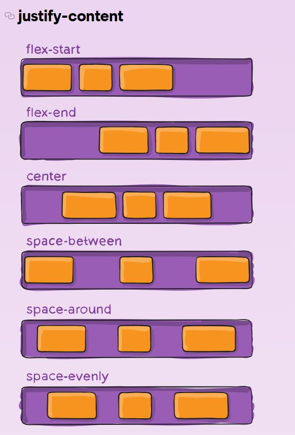

# Random-Password-Generator


<br>

## 기능  
버튼을 클릭을 하면, 랜덤으로 비밀번호를 생성하고 복사할 수 있는 기능을 구현 

<br>

## 사용한 라이브러리 
**fontAwesome**  
https://fontawesome.com/

<br>

## 학습
### 1. css : box-shadow
박스에 그림자 효과 만드는 속성   
```
box-shadow
: none | x-position y-position blur spread color | inset | initial | inherit
```
<br>  

|속성값|의미|
|---|---|
none|그림자 효과 없앰|
x-position|offset-x. 가로 위치. 양수면 오른쪽에, 음수면 왼쪽에 그림자가 만들어진다. (필수) 
y-position|offset-y. 세로 위치. 양수면 아래쪽에, 음수면 위쪽에 그림자가 만들어진다. (필수) 
blur / spread / color | 그림자 흐릿하게 / 양수면 확장, 음수면 축소 / 그림자 색 
inset | 그림자를 요소의 안쪽에 만든다.
initial | 기본값으로 설정
inherit | 부모 요소의 값을 상속
<br>

두 개의 값만 제공되면 `<offset-x>및 <offset-y>`값으로 해석  
세 번째 값이 제공되면 `<blur-radius>`로 해석   
네 번째 값이 제공되면 로 `<spread-radius>`해석

<br>

```
box-shadow: 2px 2px 2px 1px rgba(0, 0, 0, 0.2);
```
=> 순서대로 <U>2px, 2px</U>은 `<offset-x>및 <offset-y>`, <U>2px</U>은 blur, <U>1px</U>은 spread-radius, <U>rgba(0, 0, 0, 0.2)</U>은 그림자 color

<br>

### 2. css : justify-content   
기본 축(수평, 가로)에서 사용 가능한 공간을 모두 사용하지 않는 경우 유연한 컨테이너의 항목을 정렬   

<br>

|속성값|의미|
|---|---|
|flex-start (default)|플렉스 항목들을 축의 시작 부분에 정렬 	
|flex-end|플렉스 항목들을 축의 끝 부분에 정렬
|center|요소들을 컨테이너의 중심 부분에 정렬	
|space-between|첫 항목은 시작 부분에 밀착되어 정렬되고, 마지막 항목은 끝 부분에 밀착되어 요소들 사이에 동일한 간격 으로 정렬 
|space-around|각 항목들은 양쪽 여백의 절반만큼 나누어 갖습니다. 요소들 주위에 동일한 간격을 둡니다.
|space-evenly(FireFox Only)|각 항목들은 서로 간에 동일한 여백을 갖습니다

<br>



<br>

### 3. css : hover와 active, focus

|가상선택자|의미|
|---|---|
hover|마우스가 해당 요소 위에 있을 때 요소의 스타일 변경|
active|사용자의 마우스가 해당 요소를 클릭하는 순간부터 떼는 순간까지 요소의 스타일 변경
focus|사용자의 마우스가 해당 요소를 클릭하면 요소의 스타일 변경. 클릭 이외에도 탭 키를 이용해서 요소를 선택해도 활성화

<br>

### 4. js : substring
string 객체의 <u>시작 인덱스로 부터 종료 인덱스 전 까지 문자열의 부분 
문자열을 반환</u>

**사용방법**
```
str.substring(indexStart[, indexEnd])
```

```
const str = 'Mozilla';

console.log(str.substring(1, 3));
// Expected output: "oz"

console.log(str.substring(2));
// Expected output: "zilla"

```

substring() 메서드는 indexStart 부터 문자를 추출하지만 indexEnd 가 포함되지 않아도 괜찮습니다. 특징은 아래와 같습니다.  

- 만약 indexEnd 가 생략된 경우, substring() 문자열의 끝까지 모든 문자를 추출합니다.  
```
var anyString = "Mozilla";
console.log(anyString.substring(4));
// Displays 'lla'
```

- 만약 indexStart 가 indexEnd와 같을 경우, substring() 빈 문자열을 반환합니다.  
```
var anyString = "Mozilla";
console.log(anyString.substring(6, 6));
// Displays ''
```
- 만약 indexStart 가 indexEnd보다 큰 경우, substring() 메서드는 마치 두 개의 인자를 바꾼 듯 작동하게 됩니다. 아래 예제를 보세요.  
```
var anyString = "Mozilla";
console.log(anyString.substring(7, 4));
// Displays 'lla'
```
- 0보다 작은 인자 값을 가지는 경우에는 0으로, stringName.length 보다 큰 인자 값을 가지는 경우, stringName.length 로 처리됩니다. NaN 값은 0으로 처리됩니다.  

<br>

**cf. 비교 substr()과 slice()**   
**substr() 함수**  

파라미터로 입력받은 start index부터 length 길이만큼 string을 잘라내어 반환하는 함수입니다.첫번째 글자의 index는 0에서 시작합니다.
```
string.substr(startIndex, length)
```
<br>

**substring()과 substr() 비교하기** 

```
var text = "Mozilla";
console.log(text.substring(2, 5)); // => "zil"
console.log(text.substr(2, 3)); // => "zil"
```
|메소드|의미|
|---|---|
|substring()| 인수는 시작 및 끝 인덱스를 나타냄|
|substr() | 인수는 시작 인덱스와 반환된 문자열에 포함할 문자 수를 나타냄

<br>

**slice() 함수**  
substring() 함수와 마찬가지로 파라미터로 자를 문자열의 start index와 end index를 전달합니다.
```
var text = "Mozilla";
console.log(text.substring(5, 2)); // => "zil"
console.log(text.slice(5, 2)); // => ""
```

<br>

**substring()과 slice()의 차이점**  


- startIndex > endIndex 의 경우

```
var text = "Mozilla";
console.log(text.substring(5, 2)); // => "zil"
console.log(text.slice(5, 2)); // => ""
```

|메소드|의미|
|---|---|
|substring() | startIndex와 endIndex를 바꿔서 처리하므로, 문자열 리턴|
|slice()|그냥 비어있는 string, 즉 " "을 리턴 

<br>

- startIndex 또는 endIndex 값이 음수인 경우
```
var text = "Mozilla";

console.log(text.substring(-5, 2)); // => "Mo"
console.log(text.substring(-5, -2)); // => ""

console.log(text.slice(-5, 2)); // => ""
console.log(text.slice(-5, -2)); // => "zil"
```
|메소드|의미|
|---|---|
|substring() | startIndex 혹은 endIndex 값이 음수인 경우, 0으로 취급|
|slice()|문자열 끝에서 거꾸로 계산하여 인덱스를 찾기 |

<br>

### 5. js : select()와 setSelectionRange()
**select()**   
`<input>`과 `<textaear>`요소 안에 모든 텍스트를 선택할 수 있는 메소드

**setSelectionRange()**  
현재 텍스트 선택의 시작 및 끝 위치를 설정  
텍스트, 검색, URL, 전화번호 및 비밀번호 유형의 입력에만 적용

<br>

### 6. js : clipboardAPI
클립보드 명령<u>(잘라내기, 복사, 붙여넣기)</u>에 응답하거나 시스템 클립보드에 비동기적으로 접근하고 쓸 수 있는 기능을 제공

```
// 읽기
navigator.clipboard.readText().then((text) => {
    console.log('Pasted content: ', text);
});

// 쓰기 
navigator.clipboard.writeText(location.href).then(() => {
    console.log('success');
});
```

<br>

## 학습 출처
**유튜브**  
https://www.youtube.com/@JavaScriptKing  

**css 관련**  
https://developer.mozilla.org/  
https://www.w3schools.com/  

**css : box-shadow**  
https://www.codingfactory.net/10628  

**css : ssubString**  
https://hianna.tistory.com/340

**clipboard API**  
https://goldenthumb.net/Clipboard-API